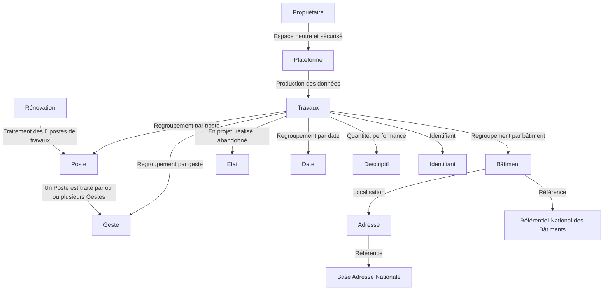

# Les Règles

A ce stade, nous sommes en mesure d'identifier clairement le contexte métier du projet ainsi que les principaux concepts qui y sont associés. L'objectif de cette partie est de définir les règles qui nous permettront de traduire ce que nous attendons du projet.

Une règle est juste une convention qui nous permet de prendre en compte une contrainte, une exigence, un critère. Ce sont ces enjeux métier qu'il nous faut d'abord identifier.

## Les enjeux métier

> [!NOTE]  
> Pour rappel, nous avons établi que la **gestion des flux de données des travaux de rénovation énergétique** est le coeur de métier du projet.

La finalité poursuivie par le projet est de disposer d'une base de données fiable et exhaustive des travaux de rénovation énergétique. Différents enjeux peuvent être identifiés selon la nature de l'exploitant : État, représentation nationale, citoyen, entreprise de travaux, opérateur de financement...

**Enjeux d'intérêt général**

- Comment suivre la dynamique des postes de rénovation traités ?
- Comment suivre la dynamique des gestes de rénovation mis en oeuvre ?
- Comment garantir l'exhaustivité, la fiabilité et la sécurité de ces informations ?

**Enjeux d'information publique**

- Comment suivre l'historique des postes traités d'un bâtiment ?
- Comment suivre l'historique des gestes mis en oeuvre d'un bâtiment ?
- Comment tracer les caractéristiques des gestes mis en oeuvre ?

**Enjeux d'interopérabilité**

- Comment éviter les doublons ?
- Comment identifier un geste de rénovation ?
- Comment distinguer les gestes en projet, effectués, abandonnés ?

## Les règles d'intérêt général

Les données publiques DOIVENT pouvoir être regroupées par poste.

Les données publiques DOIVENT pouvoir être regroupées par geste.

Les données publiques DOIVENT pouvoir être regroupées par date.

Les données publiques DOIVENT être produites par les propriétaires des travaux.

La production des données publiques DOIT être effectuée dans un espace neutre et sécurisé.

## Les règles d'information publique

Les données publiques DOIVENT pouvoir être regroupées par bâtiment.

Un bâtiment DOIT être localisable.

Les données publiques DOIVENT permettre d'identifier la quantité des travaux mis en oeuvre.

Les données publiques DOIVENT permettre d'identifier la performance des travaux mis en oeuvre.

## Les règles d'interopérabilité

Les données publiques DOIVENT être identifiables.

Les données publiques NE DOIVENT PAS être supprimés.

Les données publiques DOIVENT permettre de distinguer les travaux en projet, réalisés et abandonnés.

Un bâtiment DOIT être référencé dans le [Référentiel National des Bâtiments](https://rnb.beta.gouv.fr/).

Une adresse DOIT être référencée dans la [Base Adresse Nationale](https://adresse.data.gouv.fr/).

## En résumé

<i>Schéma d'intégration des règles métier</i>

