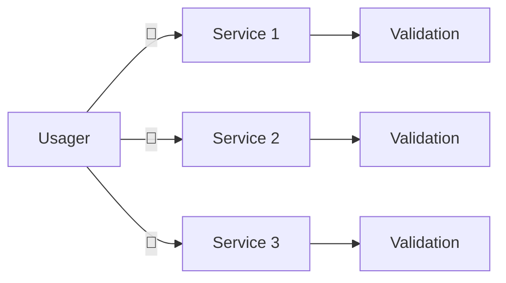
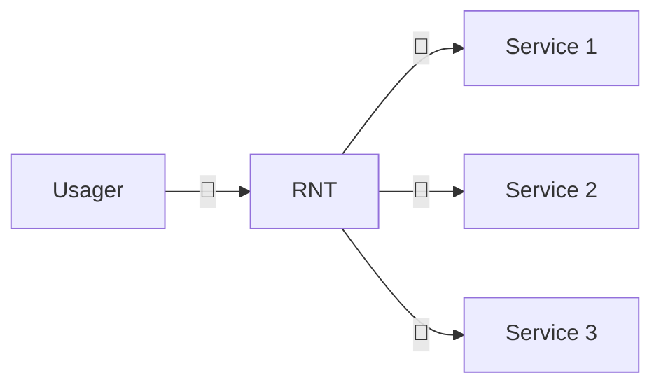

    

    <a href="https://github.com/referentiel-national-travaux-renovation">
        Le projet
    </a>&nbsp;&nbsp;&nbsp;
    <a href="https://github.com/referentiel-national-travaux-renovation/opendata">
        Données ouvertes
    </a>&nbsp;&nbsp;&nbsp;
    <a href="https://github.com/referentiel-national-travaux-renovation/documentation">
        Documentation
    </a>&nbsp;&nbsp;&nbsp;
    <a href="https://github.com/referentiel-national-travaux-renovation/api">
        API
    </a>&nbsp;&nbsp;&nbsp;
    <a href="https://github.com/referentiel-national-travaux-renovation/app">
        Plateforme
    </a>

 

# Référentiel National des Travaux de rénovation énergétique - RNT

Ce projet centralise les échanges relatifs à la mise en oeuvre du Référentiel National des Travaux de rénovation - RNT. Le RNT a été initié en 2023 dans le but d'harmoniser la manière de décrire les opérations d'économies d'énergie dans le cadre du dispositif des Certificats d'Economies d'Energie. Depuis, le projet a été adapté afin de répondre au besoin de comptabilisation des travaux de rénovation énergétique, et d'interopérabilité des systèmes d'information.

## 🎯 Cas d'usage

### Comptabilisation des travaux de rénovation énergétique

- Déclaration des travaux dans le cadre des parcours de financement de la rénovation
- Déclaration des travaux dans le cadre des réductions d'impôts locaux
- Déclaration des travaux dans le cadre des interdictions de mise à la location

### Financement des travaux de rénovation énergétique

- Utilisation du RNT comme source d'information de référence pour la description des travaux
- Utilisation du RNT comme base de données commune pour les opérateurs de financement de la rénovation

### Accompagnement des travaux

- Utilisation du RNT pour suivre l'évolution des travaux (engagement, réalisation, signalements)
- Utilisation du RNT pour identifier les étapes de rénovation à entreprendre (rénovation par étapes)

### Contrôle des travaux

- Utilisation du RNT pour optimiser l'échantillonage des travaux à contrôler
- Utilisation du RNT pour améliorer l'évaluation du risque de fraudes

## 💬 Pourquoi ?

Un projet de rénovation énergétique fait intervenir plusieurs acteurs qui répondent à des besoins spécifiques d'accompagnement, de financement ou de contrôle, mais qui partagent cependant un objet commun : les travaux. Leur description partagée est généralement formalisée par les justificatifs - devis et factures - transmis par l'usager aux différents services, chacun d'entre eux s'assurant de leur conformité.

Ce schéma pose plusieurs problèmes encore non résolus :

- Chaque service applique sa propre représentation des travaux, complexifiant la remontée d'informations utiles pour le suivi de la dynamique de rénovation.
- La redondance des procédures de transmission et validation des justificatifs alourdit le parcours de rénovation.
- La détection des irrégularités est silotée. Si un service détecte une anomalie, un autre service peut poursuivre sa mission.
- La fiabilité des informations transmises repose exclusivement sur des justificatifs dont l'authenticité et la régularité ne sont pas contrôlés, et dont le contrôle ne réglerait pas les autres problèmes.

Le Référentiel National des Travaux est une solution visant à centraliser et à harmoniser la manière de décrire les travaux de rénovation, tout en sécurisant les parcours usager.

## 🤝 Pour et avec qui ?

- Usagers du Service public de rénovation énergétique
- Observatoire national de la rénovation énergétique
- Agence nationale de l'habitat
- Opérateurs d'accompagnement
- Opérateurs de financement
- Organismes de contrôle

## 🚀 Comment ?

- [Phase 1 - La compréhension du domaine](../domain). On ne parle pas de code, mais de métier. Quel périmètre de travaux ? Quelles définitions des travaux ? Quelles données utiles pour l'usager ? Pour les acteurs des travaux ? Pour le suivi des politiques publiques ? Qui pour les collecter, les modifier ? Avec quelles règles ?

- [Phase 2 - La documentation technique](../specs). On transpose la compréhension du métier en documentation technique : Modèles de données, règles de cohérence, parcours utilisateurs, interfaces, schémas API, règles de sécurité...

- [Phase 3 - L'intégration](../integration). Comment utiliser le RNT comme source d'informations de référence pour les travaux de rénovation énergétique ?

- Phase 4 - Le développement. On code, on teste, on déploie :
  - [Documentation](https://github.com/referentiel-national-travaux-renovation/documentation)
  - [API](https://github.com/referentiel-national-travaux-renovation/api)
  - [Plateforme](https://github.com/referentiel-national-travaux-renovation/app)
  - [Open data](https://github.com/referentiel-national-travaux-renovation/opendata)

## 🧩 Ressources

- [Référentiel National des Bâtiments](https://rnb.beta.gouv.fr/)
- [Base Adresse Nationale](https://adresse.data.gouv.fr/)
- [FranceConnect](https://franceconnect.gouv.fr/)
- [ProConnect](https://www.proconnect.gouv.fr/)
- [data.gouv.fr](https://data.gouv.fr/)

## ❣️ Contribuer

Merci de consacrer de votre temps au développement de ce projet.

Nous vous invitons à prendre connaissance du [Code de conduite](/CODE_OF_CONDUCT.md).

Pour contribuer :

- Vous pouvez échanger avec la communauté directement depuis l'onglet Discussions.

- Vous pouvez proposer vos suggestions, améliorations ou correctifs depuis l'onglet Issues.

- Vous pouvez ouvrir une pull request pour apporter une modification au projet

Merci beaucoup !

## 🙏 Crédits

Ce projet s'inspire du [Référentiel National des Bâtiments](https://rnb.beta.gouv.fr/).
