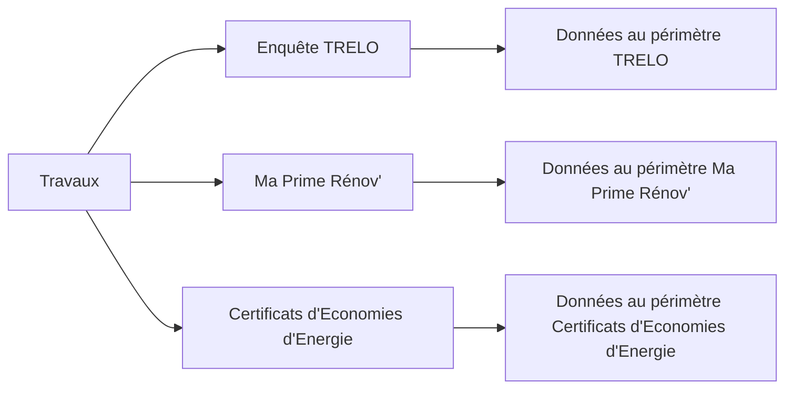
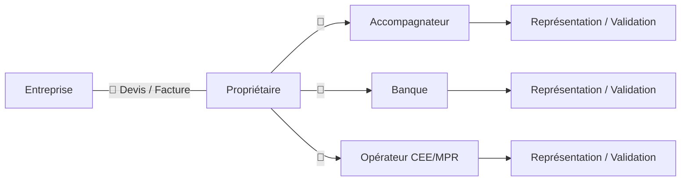

    

    <a href="https://github.com/referentiel-national-travaux-renovation">
        Le projet
    </a>&nbsp;&nbsp;&nbsp;
    <a href="https://github.com/referentiel-national-travaux-renovation/opendata">
        Données ouvertes
    </a>&nbsp;&nbsp;&nbsp;
    <a href="https://github.com/referentiel-national-travaux-renovation/documentation">
        Documentation
    </a>&nbsp;&nbsp;&nbsp;
    <a href="https://github.com/referentiel-national-travaux-renovation/api">
        API
    </a>&nbsp;&nbsp;&nbsp;
    <a href="https://github.com/referentiel-national-travaux-renovation/app">
        Plateforme
    </a>

 

# Référentiel National des Travaux de rénovation énergétique - RNT

Le Référentiel National des Travaux est une proposition de service publique numérique qui vise à définir et à centraliser les informations relatives aux travaux de rénovation énergétique réalisés en France. Ce projet fait suite aux travaux initiés en 2023 pour l'harmonisation des opérations d'économies d'énergie dans le cadre du dispositif des Certificats d'Economies d'Energie.

## 💬 Pourquoi ?

### Mieux comptabiliser les travaux de rénovation énergétique

La Stratégie Nationale Bas Carbone vise la décarbonation complète du secteur des bâtiments à l'horizon 2050. Cette ambition se traduit par l'objectif de rénovation thermique radicale du parc existant à un niveau Bâtiment Basse Consommation, à un rythme de 700 000 rénovations performantes dès 2030.

Pour évaluer l'efficacité des politiques publiques conduites pour atteindre les objectifs fixés, l'Observatoire national de la rénovation énergétique - l'ONRE - a été créé en septembre 2019. L'ONRE publie notamment un tableau de suivi de la rénovation énergétique dans le secteur résidentiel actualisé chaque année.

Les données exploitées par l'ONRE sont essentiellement issues des différents dispositifs d'aide à la rénovation énergétique - Ma Prime Rénov', Certificats d'Economies d'Energie - et de l'enquête sur les travaux de rénovation énergétique dans les logements - TRELO - menée tous les trois ans auprès des ménages.

 

 

Notre connaissance de la dynamique de rénovation repose ainsi sur des sources différentes qui ont leur propre manière de définir et comptabiliser les travaux. Un défaut d'harmonisation qui contraint la qualité, l'exhaustivité et la cohérence des données compilées, et limite notre capacité à évaluer l'efficacité des politiques publiques en la matière.

### Partager une information fiable

Un projet de rénovation énergétique fait intervenir plusieurs acteurs qui répondent à des besoins spécifiques d'accompagnement, de financement ou de contrôle, mais qui partagent cependant un objet commun : les travaux. Leur description partagée est généralement formalisée par les justificatifs - devis et factures - transmis par l'usager aux différents services, chacun d'entre eux s'assurant de leur conformité.

 

 

La qualité et la fiabilité des informations de travaux sont ainsi exclusivement justifiées par des documents dont la numérisation et le contrôle par chacun des différents services qui les exploitent, multiplie les risques de d'irrégularités et d'incohérences. Plus problématique encore, le propriétaire peut ne pas être sollicité pour valider les travaux qui font l'objet d'un financement. La doctrine documentaire des dispositifs d'aide à la rénovation favorise ainsi les pratiques frauduleuses qui visent in fine à produire un document suffisant pour l'obtention de certaines primes.

### Informer et protéger les ménages

La protection des ménages face à la recrudescence des fraudes est devenue un enjeu central pour la pérennité du service public de la rénovation énergétique. Hameçonnage, usurpation d'identité, travaux fantômes... La plupart des schémas de fraudes exploite l'exposition des ménages et la permissivité de la doctrine documentaire pour l'obtention des aides financières.

Les efforts déployés pour contrôler les justificatifs de travaux ne font ainsi que traiter le symptôme, trop tard pour protéger les ménages. Le coeur du sujet de la lutte contre la fraude est de sécuriser la production des informations relatives aux travaux, et non le formalisme réglementaire : une information fiable indépendante de la manière dont elle est matérialisée.

Enfin, savoir ce qui a déjà été fait en matière de rénovation énergétique est capital pour anticiper au mieux les travaux à entreprendre. Disposer de données fiables sur l'historique des travaux d'un bâtiment est ainsi un prérequis au déploiement d'un service public d'information des ménages afin de les aider dans la planification de leurs travaux sur toute la durée de vie de leurs logements.

## 🎯 Quoi ?

L'objectif du Référentiel National des Travaux est de constituer une base de données unique qui centralise les informations de l'ensemble des travaux de rénovation énergétique réalisés en France. Les données librement accessibles doivent permettre d'assurer le suivi de la dynamique de rénovation et de partager une information fiable à tous les acteurs du parcours de travaux.

Le RNT vise également à offrir aux usagers du service public de la rénovation énergétique un espace neutre et sécurisé dédié à la déclaration des travaux, afin d'en faire une source de référence pour les systèmes d'information de la rénovation (accompagnement, financement, contrôle).

### Livrables

- Un standard de données publiques des travaux de rénovation énergétique.
- Un fichier central des travaux de rénovation énergétique.
- Une plateforme déclarative des travaux de rénovation énergétique.

### Perspectives

#### Pour comptabiliser les travaux de rénovation énergétique

- Imposer une déclaration préalable des travaux auprès du RNT dans le cadre des parcours de financement de la rénovation ou de réductions d'impôts.

- Permettre aux ménages de déclarer leurs travaux en auto-rénovation.

#### Pour partager une information fiable

- Partager une définition commune des travaux de rénovation énergétique.

- Intégrer le RNT dans les systèmes d'information de la rénovation.

#### Pour informer et protéger les ménages

- Exploiter les données du RNT pour reconstituer l'historique des travaux de rénovation et informer les ménages sur les travaux à entreprendre et les anticiper la prise en compte des interfaces.

- Remplacer la doctrine documentaire des dispositifs d'aide à la rénovation par une doctrine déclarative auprès du RNT pour imposer une production neutre et sécurisée des informations de travaux.

## 🚀 Comment ?

- [Phase 1 - La compréhension du domaine](../wiki/domain). On ne parle pas de code, mais de métier. Quel périmètre de travaux ? Quelles définitions des travaux ? Quelles données utiles pour l'usager ? Pour les acteurs des travaux ? Pour le suivi des politiques publiques ? Qui pour les collecter, les modifier ? Avec quelles règles ?

- [Phase 2 - La documentation technique](../wiki/specs). On transpose la compréhension du métier en documentation technique : Modèles de données, règles de cohérence, parcours utilisateurs, interfaces, schémas API, règles de sécurité...

- [Phase 3 - L'intégration](../wiki/integration). Comment utiliser le RNT comme source d'informations de référence pour les travaux de rénovation énergétique ?

- Phase 4 - Le développement. On code, on teste, on déploie :
  - [Documentation](https://github.com/referentiel-national-travaux-renovation/documentation)
  - [API](https://github.com/referentiel-national-travaux-renovation/api)
  - [Plateforme](https://github.com/referentiel-national-travaux-renovation/app)
  - [Open data](https://github.com/referentiel-national-travaux-renovation/opendata)

## 🤝 Pour et avec qui ?

- Usagers du Service public de rénovation énergétique
- Observatoire national de la rénovation énergétique
- Agence nationale de l'habitat
- Opérateurs d'accompagnement
- Opérateurs de financement
- Organismes de contrôle

## 🧩 Ressources

- [Référentiel National des Bâtiments](https://rnb.beta.gouv.fr/)
- [Base Adresse Nationale](https://adresse.data.gouv.fr/)
- [FranceConnect](https://franceconnect.gouv.fr/)
- [ProConnect](https://www.proconnect.gouv.fr/)
- [data.gouv.fr](https://data.gouv.fr/)

## ❣️ Contribuer

Merci de consacrer de votre temps au développement de ce projet.

Nous vous invitons à prendre connaissance du [Code de conduite](/CODE_OF_CONDUCT.md).

Pour contribuer :

- Vous pouvez échanger avec la communauté directement depuis l'onglet Discussions.

- Vous pouvez proposer vos suggestions, améliorations ou correctifs depuis l'onglet Issues.

- Vous pouvez ouvrir une pull request pour apporter une modification au projet

Merci beaucoup !

## 🙏 Crédits

Ce projet s'inspire du [Référentiel National des Bâtiments](https://rnb.beta.gouv.fr/).
